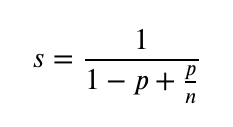
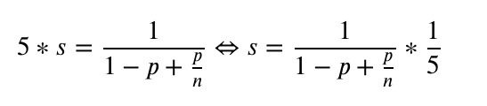
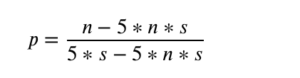
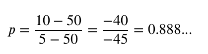

# Assignment 1, Aeneas Grüter, 16-116-352
## Exercise 1.1
#### Execution Times
| N | T   | Time [s] |
|---|-----|----------|
| 10'000'000 | 1   | 4.7      |
| 10'000'000 | 2   | 2.9      |
| 10'000'000 | 4   | 1.8      |
| 10'000'000 | 8   | 1.4      |
| 10'000'000 | 16  | 1.4      |
| 100'000'000 | 1   | 103.8    |
| 100'000'000 | 2   | 63.5     |
| 100'000'000 | 4   | 35.1     |
| 100'000'000 | 8   | 19.7     |
| 100'000'000 | 16  | 22.6     |

## Exercise 1.2
#### Execution Times
| N | T   | Time [s] |
|---|-----|----------|
| 10'000'000 | 1   | 4.6      |
| 10'000'000 | 2   | 2.6      |
| 10'000'000 | 4   | 1.5      |
| 10'000'000 | 8   | 1.3      |
| 10'000'000 | 16  | 1.4      |
| 100'000'000 | 1   | 107.8    |
| 100'000'000 | 2   | 55.3     |
| 100'000'000 | 4   | 27.5     |
| 100'000'000 | 8   | 16.8     |
| 100'000'000 | 16  | 24.4     |

## Exercise 1.3
#### Comments
A fair ReentranceLock has been used for the implementation in order to avoid a Dead-Lock where the producers always produce and the consumer can never consume to make some space free in the buffer. This problem occured when a lot of threads were involved i.e. the number of threads were high.

The SharedBuffer implements the required functionality. The Producer and Consumer classes are example classes that test the SharedBuffer. They Producer produces Integers from 1 to a given number and the consumer consumes the as many times as a given number.
This implies, that the buffer should be empty in the end. 

The SharedBufferRunner comes with the main method where the parameters can be passed. Note that the program should be executed with
``java SharedBufferRunner T N``

## Exercise 1.4
We need to decide for a particular application between the following two processors

* Uniprocessor with 5 Zillion Instructions per second
* Multiprocessor with 10 cores with 1 Zillion Instructions per second each

Amdahl's law states:

where
* s denotes the speedup
* p denotes the fraction of code, that can be executed in parallel
* n denotes the number of processors in the multiprocessor

To determine which one is the faster processor for a particular application, we need to calculate the speedup when running this program on both of the two processes. This can be achieved when the value p for a particular application is known. If the speedup is more than 1, the multiprocessor will execute the program faster, otherwise the single processor.

As the uniprocessor can execute 5 times more instructions per time unit, the speedup must be divided by factor 5.

We solve then the equation for p:

We set s = 1, n = 10 and obtain:

This means, if p is larger or equal to 88.8 %, the multiprocessor should be bought because there is an actual performance gain. Otherwise, the concrete application will run faster on the uniprocessor and this should be the one to buy. 