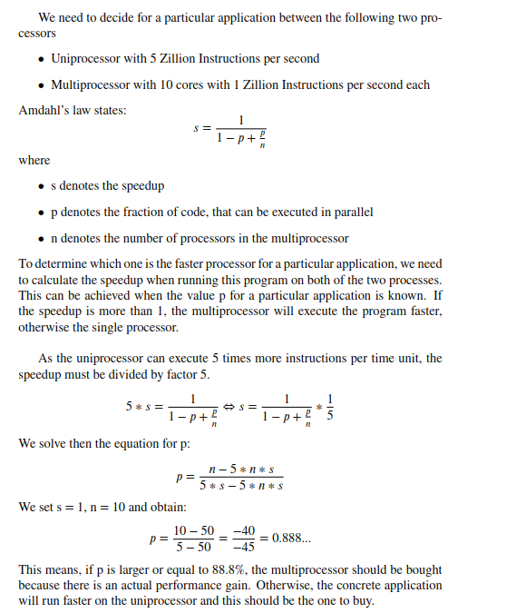

# Assignment 1, Aeneas Grüter, 16-116-352
## Exercise 1.1
| N | T   | Time [s] |
|---|-----|----------|
| 10'000'000 | 1   | 4.8      |
| 10'000'000 | 2   | 2.8      |
| 10'000'000 | 4   | 1.8      |
| 10'000'000 | 8   | 1.3      |
| 10'000'000 | 16  | 1.3      |
| 100'000'000 | 1   | 107.0    |
| 100'000'000 | 2   | 62.0     |
| 100'000'000 | 4   | 37.0     |
| 100'000'000 | 8   | 19.0     |
| 100'000'000 | 16  | 23.0     |

## Exercise 1.2
| N | T   | Time [s] |
|---|-----|----------|
| 10'000'000 | 1   | 4.9      |
| 10'000'000 | 2   | 2.6      |
| 10'000'000 | 4   | 1.5      |
| 10'000'000 | 8   | 1.3      |
| 10'000'000 | 16  | 1.6      |
| 100'000'000 | 1   | 99.0     |
| 100'000'000 | 2   | 53.0     |
| 100'000'000 | 4   | 27.0     |
| 100'000'000 | 8   | 16.0     |
| 100'000'000 | 16  | 25.0     |

## Exercise 1.3
#### Comments
A fair ReentranceLock has been used for the implementation in order to avoid a Dead-Lock where the producers always produce and the consumer can never consume to make some space free in the buffer. This problem occured when a lot of threads were involved i.e. the number of threads were high.

The SharedBuffer implements the required functionality. The Producer and Consumer classes are example classes that test the SharedBuffer. They Producer produces Integers from 1 to a given number and the consumer consumes the as many times as a given number.
This implies, that the buffer should be empty in the end. 

The SharedBufferRunner comes with the main method where the parameters can be passed. Note that the program should be executed with
``java SharedBufferRunner T N``

## Exercise 1.4

